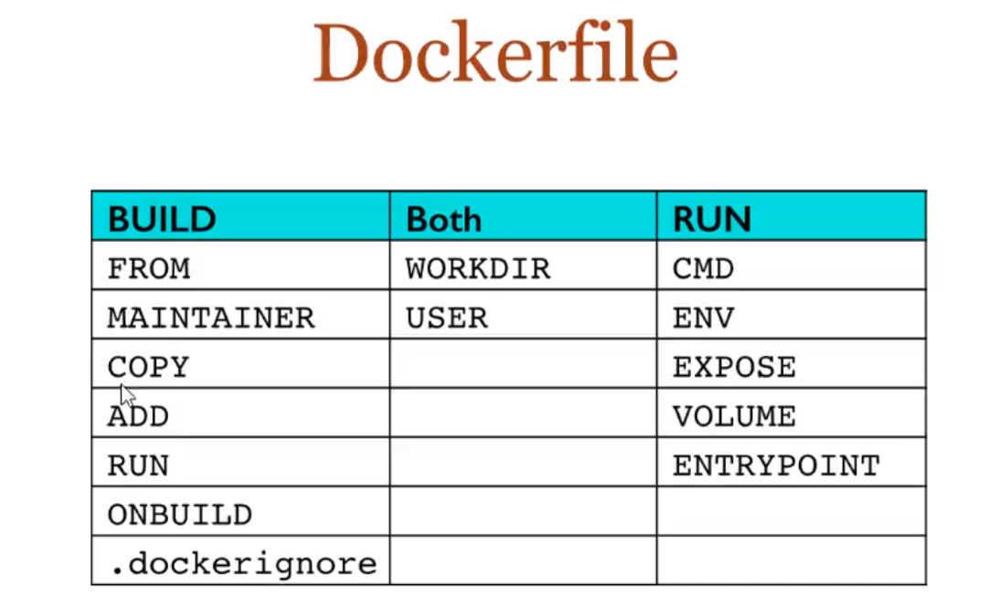

## DockerFile 构建




指令解释：

```shell
FROM          #基础镜像
MAINTAINER    #镜像作者信息
RUN            #镜像勾线的时候需要运行的命令
ADD            #步骤：tomcat镜像，添加内容
WORKDIR        #镜像工作目录
VOLUME         #挂载目录
EXPORT         #保留端口配置

CMD            #指定这个容器启动的时候要运行的命令，只有最后一个会生效，可被替代
ENTRYPOINT     #指定这个容器启动的时候要运行的命令，可追加命令
ONBUILD        #当构建一个被继承的一个DockerFile。会运行ONBUILD的指令（触发指令）
ENV            #构建设置环境变量
```

### EXAMPLE:

dockerHub 中大多镜像源自scrach

```dockerfile

#编写DockerFIle文件
FROM centos:centos7
MAINTAINER liam<quan.2003@outlook.com>

ENV MYPATH /usr/local
WORKDIR $MYPATH

RUN yum update -y
RUN yum -y install vim 
RUN yum -y install net-tools

EXPOSE 80

CMD echo $MYPATH    
CMD echo "ddddd"    
CMD /bin/bash

#构建镜像
docker build -f centos_docker  -t my_centos:0.1 .

Successfully built e23015e71544
Successfully tagged my_centos:0.1

```

### CMD&ENRTYPOINT

```shell
CMD            #指定这个容器启动的时候要运行的命令，只有最后一个会生效，可被替代
ENTRYPOINT     #指定这个容器启动的时候要运行的命令，可追加命令
```

```shell
FORM centos
CMD ["ls","-a"]

docker build -f centos-docekr -t mydocker .
docker run <docekr-id>
#执行CMD命令
```

