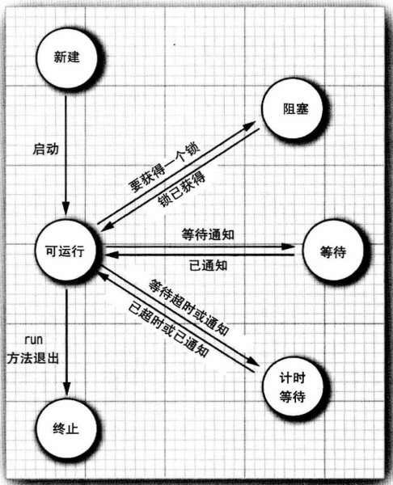
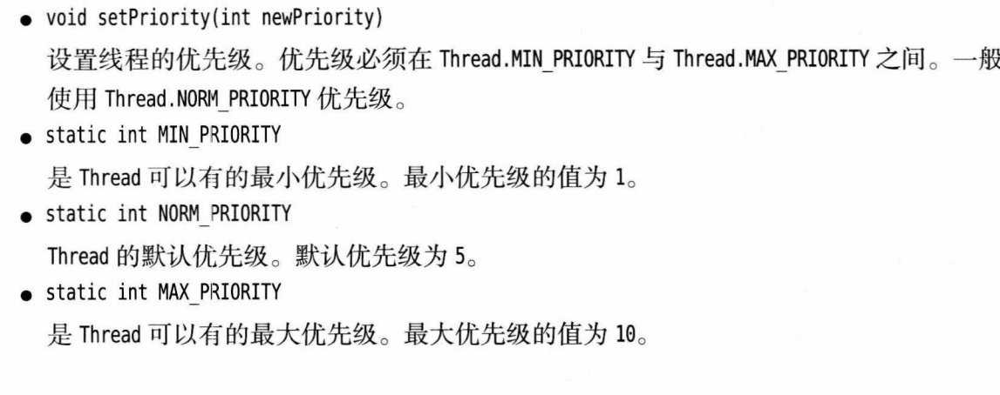
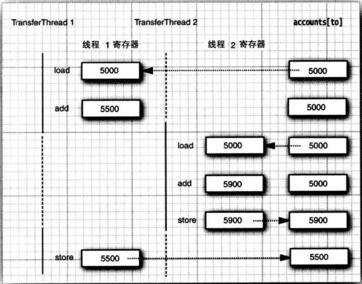
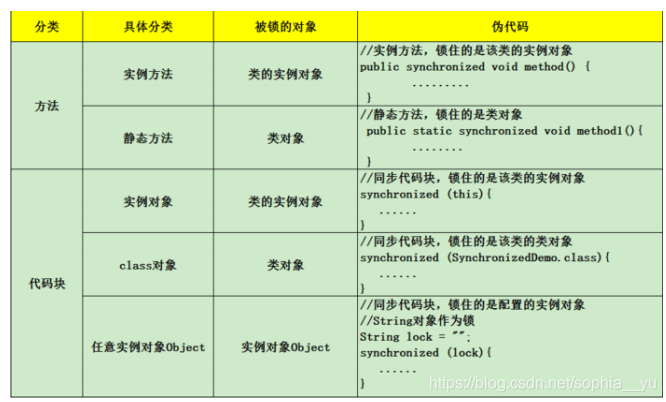
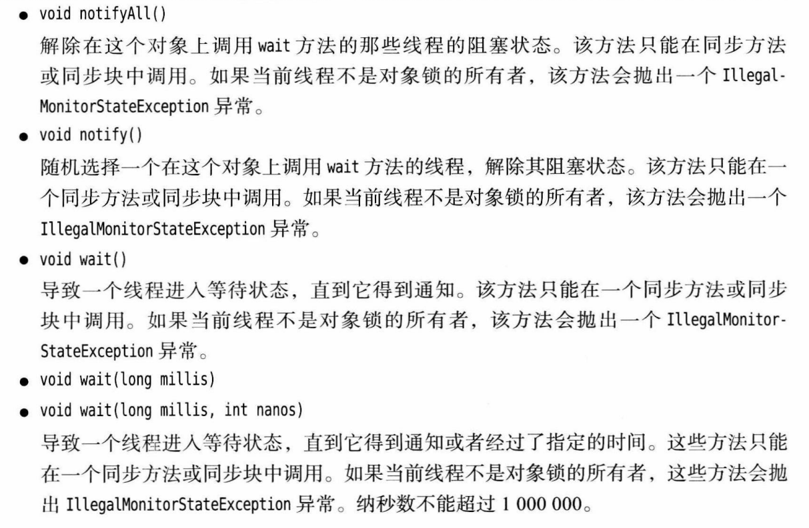

# 并发

每个进程之间按都有自己的一整套变量，而线程之间则共享数据。

### 线程：

> 实现多线程方法：
>
> * 构造Runnable接口的类实例
> * 继承Thread类（不推荐，应当将并行运行任务和运行机制解耦）
> * 构造线程池

```java
//Runnable接口：
public interface Runnable
{
    void run();
}
```

```java
//例子：
public class demo1 implements Runnable{   //创建接口类实例
    @Override                             //覆写方法
    public void run() {
        for (int i = 0; i < 100; i++) {
            System.out.println("being print number:"+i);
        }
    }

    public static void main(String[] args) {
        demo1 a_demo1=new demo1();          //新建类实例对象
        new Thread(a_demo1).start();        //利用线程类开启
        for (int i = 0; i < 1000; i++) {
            System.out.println("main");
        }
    }
}
```


#### 线程状态：

|          状态           |                                            |
| :---------------------: | ------------------------------------------ |
|           New           | 此时程序还有一些基础工作来运行线程代码     |
|        Runnable         | 可运行，不一定运行or始终运行，依赖系统调度 |
|         Blocked         | 暂时不活动，不运行代码                     |
|         Waiting         | 暂时不活动，不运行代码                     |
| TImed waiting(计时等待) | 暂时不活动，不运行代码                     |
|       Terminated        | 终止后无法从断点开始                       |

> 抢占式调度：会给每一个线程分配时间片执行任务，时间用完后，操作系统选择下一线程

阻塞和等待条件：

* 但一个线程试图获取内部对象锁但不成功。
* 线程等待两一个线程通知条件。
* 超时参数让线程进入计时等待状态。



终止条件：

* 自然退出
* 因为没有捕获的异常而退出

```java
static void yield();
void join();
void ioin(long millis);
Thread.State getState();
```


### 线程属性：

#### 中断线程：

线程终止：执行完最后一条语句or因为没有捕获的异常而退出。没有任何方法可以强制中断线程。

interrupt方法：（线程应该时不时检查这个标志）可以设置线程中断状态：

```java
//如果线程被阻塞，则无法检测中断，则要引入InterruptedException异常。
//被中断的线程可以决定如何响应中断。
while(!Thread.currentThread().isInterrupted()&&more work to do)
{
    do some thing;
}
```

> 如果循环中调用了```sleep```则不要检测中断状态，应捕获```InterruptedException```.
>
> 调用interrupted会清除线程中断状态，检查线程是否中断。


#### 守护线程：

Java中有两类线程：

* User Thread
* Daemon Thread

所谓的守护线程，指的是程序运行时在后台提供的一种通用服务的线程。比如垃圾回收线程就是一个很称职的守护者，并且这种线程并不属于程序中不可或缺的部分。因此，当所有的非守护线程结束时，程序也就终止了，同时会杀死进程中的所有守护线程。反过来说，只要任何非守护线程还在运行，程序就不会终止。

```java
//调用setDaemon将其转换为守护进程
t.setDaemon(true);
```

* 不能将正在运行的常规线程设置成守护线程。
* Daemon线程中产生的新线程也是Daemon


#### 线程名：

```java
var t=new Thread(runnable);
t.setName("Web crawler");
```


#### 未捕获异常：(???)

run方法不能抛出检查型错误，但异常会使线程死亡。


#### 线程优先级：

> 现在不要使用线程优先级了




### 同步：

竟态条件：多个线程同时修改同一个数据。



所以我们应该确保线程失去控制之前，方法应该**已经运行完成**。


#### 锁对象：

重入锁：```ReentrantLock```,构造一个重入锁来保护临界区。

```Reentrantlock```保护代码块结构：

```java
mylock.lock();    //a ReentrantLock object
try
{
    critical section
}
finally
{
    myLock.unlock();    //必须有这一句在Finnally里面，锁必须释放
}
```

重入锁：线程可以反复获得已经拥有的锁，锁有一个**持有计数**来跟踪对lock方法的嵌套调用。被一个锁保护的代码可以调用另一个使用相同锁的方法。


#### 条件对象（conditional variable）又叫条件变量：

管理那些已经获得一个锁，却不能做有用工作的线程。一个锁变量可以有一个或多个相关联的条件对象。你可以用```newCondition```方法获得一个条件对象。

```java
class Bank
{
    private Condition sufficientFunds;
    public Bank()
    {
        sufficientFunds = bankLock.newCondition();
    }
}
```

调用```sufficientFunds.await();```可以使当前线程暂停，并放弃锁，进入条件的***等待集***。直到另一线程在同一条件上调用```signalALL```方法。

当另一线程完成转账后，应该调用：```sufficientFunds.signalALL()```，来重新激活等待这个条件的所有线程。线程将从之前暂停的地方继续执行。否则将会产生**死锁**现象。

> await调用应该放在如下形式的循环当中
>
> ```
> while( !(OK to proceed) )
> 	condition.await();
> ```

```signalALL```调用会随机选择一个等待集中的一个线程，并解除当前线程的阻塞状态。

> 只有拥有一个条件的锁时，才能调用。

总结：

* 一次只能有一个线程执行被保护的代码
* 锁可以管理试图进入被保护代码段的线程or进入代码段但不能运行的线程
* 锁可以有多个相关联的条件变量对象


#### synchronized关键词：

   synchronized是一种同步器，用来解决线程并发安全问题，采取的方案是**序列化访问临界资源**，也就是**同步互斥访问**。其本质就是加锁。表示此时只有一个线程进入同步方法。

原理：

 1. synchronized是一种对象锁(锁的是对象而非引用)，是可重入的。其加锁的方式有三种：

          1）同步实例方法，锁是当前实例对象。

          2）同步类方法，锁是当前类对象。

          3）同步代码块，锁是括号里面的对象。

 2. 

  2. synchronized底层原理

                synchronized是基于JVM内置锁实现，通过内部对象Monitor(监视器锁)实现，基于进入与退出Monitor对象实现方法与代码块同步，监视器锁的实现依赖底层操作系统的Mutex lock（互斥锁）实现，它是一个重量级锁性能较低。JVM内置锁在1.5之后版本做了重大的优化，如锁粗化（Lock Coarsening）、锁消除（Lock Elimination）、轻量级锁（Lightweight Locking）、偏向锁（Biased Locking）、适应性自旋（Adaptive Spinning）等技术来减少锁操作的开销，，内置锁的并发性能已经基本与Lock持平。 

        synchronized关键字被编译成字节码后会被翻译成monitorenter 和 monitorexit 两条指令分别在同步块逻辑代码的起始位置与结束位置。    

Java的每一个**对象**都有一个内部锁如果一个方法声明时有```synchronized```关键词，那么对象的锁将会保护整个方法。

```java
public synchronized void method()
{
    method body;
}
//等价于下面
public void method()
{
    this.intrinsicLock.lock();
    try
    {
        method body;
	}
    finally
    {
        this.intrinsicLock.unlock();
    }
}
```

```java
//调用
//wait(),notifyALL()
//等价于
//intrisicCondition.await()
//instrisicCondition.signalALL()
```

> 如果静态方法被声明为同步，则会获得相关类对象的内部锁，没有其他线程可以调用这个类的该方法或者任何其他同步静态方法





#### 同步块：

同步代码块指同一时刻只有一个线程进入同步代码块，但是多个线程可以进入方法。

```java
//这段代码将会获得obj的锁。
synchronized(obj)
{
    critical section;
}
```

==总结：synchronized(this)以及普通synchronized方法，只能防止多个线程同时执行同一对象的同步端，synchronized锁的括号中的对象而非代码。==


**全局锁：**

全局锁，锁住的类对象，并不是类实例化出的对象。

```java
class A
{
    synchronized static  public void print()
    //定义为静态方法，也就是将A这个类锁住，那么同一时刻，只能有一个类对象进入代码块
    {
        System.out.println(Thread.currentThread().getName()+":进入print方法");
        try {
            Thread.sleep(100);
        } catch (InterruptedException e) {
            e.printStackTrace();
        }
        System.out.println(Thread.currentThread().getName()+":离开print方法");
    }

}
class MythreadB implements  Runnable
{

    public void run()
    {
       A.print();
    }
}
public class Synch
{
    public static void main(String[] args) {
        MythreadB thread=new MythreadB();
        new Thread(thread,"线程1").start();
        new Thread(thread,"线程2").start();
        new Thread(thread,"线程3").start();
    }
}
//**********************************************************************************************
  同步代码块 ：synchronized(类名称.class)
class A
{
      public void print()
      {
          synchronized (A.class)
          {
              System.out.println(Thread.currentThread().getName() + ":进入print方法");
              try {
                  Thread.sleep(100);
              } catch (InterruptedException e) {
                  e.printStackTrace();
              }
              System.out.println(Thread.currentThread().getName() + ":离开print方法");
          }
      }
}
class MythreadB implements  Runnable
{
    public void run()
    {
      new A().print();
    }
}

```


### 监视器：

特性：

* 监视器是只包含私有字段的类
* 监视器类的每一个对象都有一个关联的锁
* 所有方法都有这个锁锁定
* 锁可以有任意多个相关联的条件


### volatile字段：

volatile关键词为实例字段的同步访问提供了一种免锁机制，声明该字段可能被另一个线程并发更新。

