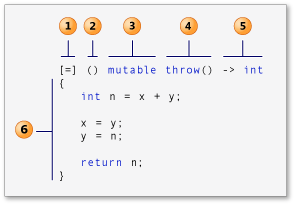

# `lambda`  表达式学习 (C++)

## 1.0    `Lambda` 语法

> 下图显示了 lambda 语法的各个部分：
>
> 1. `捕获列表`：（capture list）（在 C++ 规范中也称为 Lambda 引导。）
>
> 2. `参数列表`：（parameters list）（可选）。 （也称为 Lambda 声明符）
>
> 3. `mutable 规范`：（可选）。
>
> 4. `异常说明`：exception-specification（可选）。
>
> 5. `返回类型`：trailing-return-type（可选）。
>
> 6. `Lambda 体`：也就是函数体。
>    
>
>    

Lambda表达式与函数指针类似，都可以用于定义函数对象。但是，Lambda表达式相比函数指针具有以下优点：

- Lambda表达式可以捕获外部变量，从而方便地访问外部环境；
- Lambda表达式可以定义在函数内部，从而避免了命名冲突的问题；
- Lambda表达式可以使用auto关键字自动推导返回值类型，从而简化代码。

## 1.1   捕获列表

Lambda表达式的捕获列表用于指定Lambda表达式中使用的外部变量。捕获列表可以为空，也可以包含以下内容：

- `[]`：不捕获任何外部变量；
- `[&]`：以引用方式捕获所有外部变量；
- `[=]`：以值方式捕获所有外部变量；
- `[var1, var2, ...]`：指定捕获特定的外部变量；
- `[&, var1, var2, ...]`：以引用方式捕获所有外部变量，并指定捕获特定的外部变量；
- `[=, &var1, &var2, ...]`：以值方式捕获所有外部变量，并以引用方式捕获特定的外部变量。