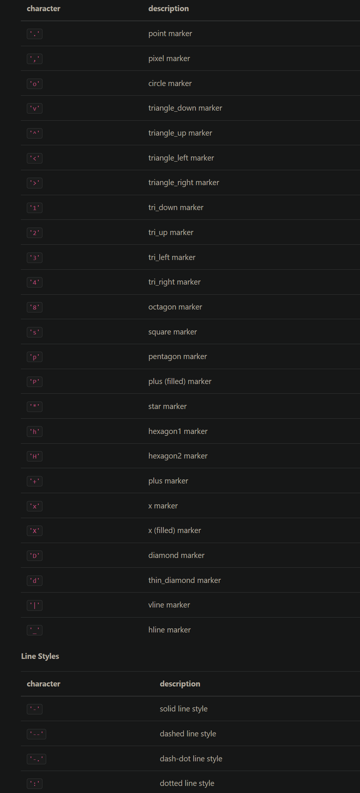

# `Pyplot tutorial`

## `Introduction to pyplot`

> ```python
> matplotlib.pyplot.plot(*args,scalex = True, scaley=True,data=None, **kwargs)
> ```
>
> ```python
> plot([x], y, [fmt], *, data=None, **kwargs)
> plot([x], y, [fmt], [x2], y2, [fmt2], ..., **kwargs)
> ```

Each pyplot function makes some change to a figure. 

```python
import matplotlib.pyplot as plt
plt.plot([1, 2, 3, 4])
plt.plot([1, 2, 3, 4], [1, 4, 9, 16])
plt.ylabel('some numbers')
plt.show()
```

In the example above, `matplotlib` assumes it is a sequence of y values, and automatically generates the x values for you.

### Formatting the style of your plot

```python
plt.plot([1, 2, 3, 4], [1, 4, 9, 16], 'ro')
plt.axis([0, 6, 0, 20])
plt.show()
```


```python
xmin, xmax, ymin, ymax = axis()
xmin, xmax, ymin, ymax = axis([xmin, xmax, ymin, ymax])   #The axis limits to be set. This can also be achieved using   ax.set(xlim=(xmin, xmax), ylim=(ymin, ymax))

xmin, xmax, ymin, ymax = axis(option)
xmin, xmax, ymin, ymax = axis(**kwargs)
```

> plot
>
> 

If `matplotlib` were limited to working with lists, it would be fairly useless for numeric processing. The example below illustrates plotting several lines with different format styles in one function call using array.

```python
import numpy as np

# evenly sampled time at 200ms intervals
t = np.arange(0., 5., 0.2)

# red dashes, blue squares and green triangles
plt.plot(t, t, 'r--', t, t**2, 'bs', t, t**3, 'g^')
plt.show()
```

### Plotting with keyword strings

